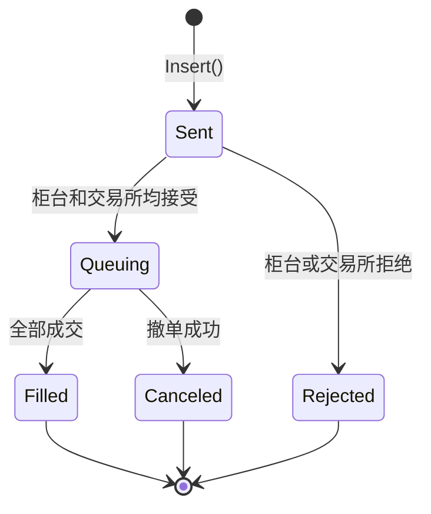

# TinyTrader —— Strategy to Live Trading in One Line

**极简轻量，一行实盘。**

TinyTrader 是一个基于 CTP 的 C++ 交易引擎，同时提供 Python 接口。支持单账户、单策略的期货与期权交易。

主要特点：

- **极简**————无抽象概念、无配置文件，写好策略、填上账号，一行代码启动实盘。

- **轻量**————核心代码不到 1000 行。

- **快速**————单线程事件模型，全程无锁，微秒级响应。

## 📦 快速开始

```bash
pip install tinytrader
```

**零依赖。** 不安装任何第三方包。支持 Python 3.9 至 3.13 版本。

一个完整的交易程序(`examples/minimal.py`)：启动后立即下单。

```python
import tinytrader as tt

class MyStrategy(tt.Strategy):
	def OnStart(self):
		order = tt.NewOrder()
		order.Instrument = tt.Contract("rb2610")
		order.Size = -2
		order.Price = 4100
		self.Insert(order)

if __name__ == "__main__":
	config = tt.Config()
	config.UserID = "12345678"
	config.Password = "my_password"
	config.AppID = "simnow_client_test"
	config.AuthCode = "0000000000000000"
	config.BrokerID = "9999"
	config.TradeFront = "tcp://182.254.243.31:30002"
	config.MarketFront = "tcp://182.254.243.31:30012"
	# 以上为 CTP 账号及地址

	tt.AutoRun(config, MyStrategy)		# 一行启动
```

策略启动后立即以 4100 的价格卖出 2 手 rb2610。`Size` 大于 0 为买单，小于 0 为卖单。开平标志默认自动(平仓优先)。

同样的功能，C++ 版 (`examples/minimal.cpp`)：

```cpp
#include "tinytrader.h"

using namespace tinytrader;

class MyStrategy : public Strategy
{
	void OnStart() override
	{
		NewOrder order;
		order.Instrument = "rb2610";
		order.Size = -2;
		order.Price = 4100;
		Insert(order);
	}
};

int main()
{
	Config config;
	config.UserID = "12345678";
	config.Password = "my_password";
	config.AppID = "simnow_client_test";
	config.AuthCode = "0000000000000000";
	config.BrokerID = "9999";
	config.TradeFront = "tcp://182.254.243.31:30002";
	config.MarketFront = "tcp://182.254.243.31:30012";
	// 以上为 CTP 账号及地址

	return AutoRun<MyStrategy>(config);		// 一行启动
}
```

和 Python 版一样简单！C++ 不仅速度更快，编译成二进制后可以更好地保护策略逻辑。

更多示例见 `examples` 目录，同时有 C++ 和 Python 版本。

## ⚠️ 安全警告 

示例程序为保持简洁，直接将账号密码写在代码中。**此举可能导致密码泄露**，实盘应尽量手动输入密码。


## 📦 C++ 编译

依赖项 CTP API 、fmtlib、fmtlog、magic_enum 均已包含在 third_party 目录中。

编译器需支持 C++17 标准 (GCC 11.5 和 MSVC 2022 已测试)。

进入 TinyTrader 代码目录，执行以下命令，即可生成所有示例程序。
```bash
mkdir build
cd build
cmake .. 
cmake --build . --config Release
```

如需调试版，将最后一行的 `Release` 改成 `Debug` 即可。

如果使用 Visual Studio，还可以直接用 VS 打开文件夹，然后在菜单栏选择 "生成"->"全部生成"。

如需从源码编译 Python 接口，可参考 `docs/build_python.md`。


## 📦 下单参数

`NewOrder` 包含全部下单参数：

| 字段			| 类型			| 说明								|
| :---			| :---			| :---								|
| `Instrument`	| `Contract`	| 合约，如 `"rb2610"`				|
| `Size`		| `int`			| 委托量，**正=买，负=卖**			|
| `Price`		| 浮点数			| 价格								|
| `Type`		| `OrderType`	| 订单类型，默认 `GFD`（单日有效）		|
| `Flag`		| `TradeFlag`	| 开平标志，默认 `Auto`（自动开平）	|

**订单类型：**

| 类型	| 说明					|
| :---	| :---					|
| `GFD` | 单日有效				|
| `FAK` | 立即成交剩余撤销		|
| `FOK` | 立即全部成交否则撤销	|

**开平标志：**

| 标志				| 说明					|
| :---				| :---					|
| `Auto`			| 自动开平（平仓优先）	|
| `Open`			| 开仓					|
| `Close`			| 平仓					|
| `CloseToday`		| 平今					|
| `CloseYesterday`	| 平昨					|

上期所和能源中心明确区分平今平昨，如果使用 `Auto`，会根据现有仓位按照平今、平昨、开仓的优先级进行设置。

**Python：**
```python
order = tt.NewOrder()
order.Instrument = tt.Contract("rb2610")
order.Size = -2           # 卖 2 手
order.Price = 4100
order.Type = tt.OrderType.FAK
order.Flag = tt.TradeFlag.Auto
self.Insert(order)
```

**C++：**
```c++
NewOrder order;
order.Instrument = "rb2610";
order.Size = -2;
order.Price = 4100;
order.Type = OrderType::FAK;
order.Flag = TradeFlag::Auto;
Insert(order);
```

## 📦 订单生命周期

订单主要有以下几种状态，由枚举类型 `OrderStatus` 表示：

| 状态		| 说明							|
| :---		| :---							|
| `Sent`	| 已向柜台发送					|
| `Queuing` | 处于交易所队列中（含部分成交）	|
| `Filled`	| 全部成交						|
| `Canceled`| 已撤单							|
| `Rejected`| 被柜台或交易所拒绝				|

`Insert` 函数调用成功，即产生新的订单，其状态为初始值 `Sent`。

如果下单成功，订单状态会变成 `Queuing`，直到全部成交(变成 `Filled`)或撤单成功(变成 `Canceled`)。部分成交并不改变订单的状态，仍为 `Queuing`。

如果下单失败，订单状态会从 `Sent` 直接变成 `Rejected`。



## 📦 订单字段

`Order` 对象由引擎自动创建和维护，策略中只能查看，不能修改。

| 字段			| 类型			| 说明								|
| :---			| :---			| :---								|
| `Instrument`	| `Contract`	| 合约								|
| `Size`		| `int`			| 委托量（正=买，负=卖）				|
| `Price`		| 浮点数			| 价格								|
| `Type`		| `OrderType`	| 订单类型							|
| `Flag`		| `TradeFlag`	| 开平标志							|
| `Status`		| `OrderStatus` | 订单状态（见下方）					|
| `Canceling`	| `bool`		| 是否有撤单指令在途					|
| `Error`		| `int`			| 错误码，0 表示正常					|	
| `FilledSize`	| `int`			| 已成交数量（带方向）				|
| `TradedSize`	| `int`			| 已成交数量（成交回报累计，带方向）	|
| `TradedValue` | 浮点数			| 成交金额（累计）					|

卖单的 `Size`、`FilledSize` 和 `TradedSize` 都是负值，买单都是正值。

订单不同状态对应的字段值：

| 状态描述		| `Status`		| `FilledSize`				| `Error`	|
| :---			| :---			| :---						| :---		| 
| 已发送 		| `Sent`		| 0							| 0			|
| 下单成功 		| `Queuing`		| 0							| 0			|
| 部分成交 		| `Queuing`		| 非 0 且不等于 `Size`		| 0			|
| 全部成交 		| `Filled`		| 等于 `Size	`				| 0			|
| 撤单成功 		| `Canceled`	| 可能为 0，一定不等于 `Size`	| 0			|
| 下单失败 		| `Rejected`	| 0							| 非 0		|

**`FilledSize` 与 `TradedSize` 的区别：**

- `FilledSize`：来自订单状态回报，反映当前成交数量
- `TradedSize`：来自成交回报，逐笔累计

两者来自不同的回报消息，可能出现短暂不一致，最终会收敛于同一个值。

**Python：**
```python
def OnOrder(self, o: tt.Order):
	# 防止重复撤单
	if o.Status == tt.OrderStatus.Queuing and not o.Canceling:
		self.Cancel(o)
```

**C++：**
```c++
void OnOrder(const Order& o) override
{
	// 防止重复撤单
	if (o.Status == OrderStatus::Queuing && !o.Canceling)
		Cancel(&o);
}
```

## 📦 策略接口

策略类必须继承自 `Strategy`，并按需覆写回调函数：

| 回调函数					| 参数									| 触发时机						|
| :---						| :---									| :---							|
| `SubscribeList()`			| —										| 返回合约列表，引擎自动订阅行情	|
| `OnStart()`				| —										| 策略启动时触发一次				|
| `OnTimer()`				| —										| 定时触发，间隔可配置			|
| `OnQuote(quote)`			| `quote`: 行情数据						| 每笔行情到达时					|
| `OnOrder(order)`			| `order`: 订单数据						| 订单状态变化时					|
| `OnTrade(trade, order)`	| `trade`: 成交数据，`order`: 关联订单	| 产生成交时						|

### 订阅行情

**Python：**
```python
	def SubscribeList(self):
		return [tt.Contract("rb2610"), tt.Contract("hc2610")]
```

**C++：**
```cpp
	std::vector<Contract> SubscribeList() const override
	{ 
		return {"rb2610", "hc2610"};
	}
```

订阅后，每收到一笔新行情，引擎就会自动调用 `OnQuote` 函数。

### 下单

**Python：**
```python
# 发送成功返回 Order 失败 None，开平标志若为 Auto 会被重设
def Insert(self, order: NewOrder):
	pass
```

**C++：**
```c++
// 发送失败返回空指针，开平标志若为 Auto 会被重设
const Order* Insert(NewOrder& order);
```

### 撤单
**Python：**
```python
# 发送成功返回 True 失败 False
def Cancel(self, order: Order):       
	pass
```

**C++：**
```c++
// 发送成功返回 true 失败  false
bool Cancel(const Order& order);
```

## 📦 自由函数

| 函数					| 功能						| 说明									|
| :---					| :---						| :---									|
| `Now` 				| 获取当前时间				| 北京时间								|
| `TodayAt` 			| 获取当日指定时间			| 入参应为 HH:MM:SS 格式，不检查			|
| `TradingDay`			| 获取交易日					| 18 点前返回当日否则次日，周末顺延至周一	|
| `GetPosition`			| 获取单个合约的持仓			| 无需柜台查询							|
| `GetPositions`		| 获取所有持仓				| 无需柜台查询							|
| `GetQuote`			| 获取最新行情				| 无需柜台查询							|
| `InitEngine`			| 初始化交易引擎				| 完成后才可创建策略对象					|
| `Run`					| 订阅行情并启动策略			| 不返回									|
| `AutoRun`				| 一行启动策略				| 										|
| `MakeCache`			| 创建合约信息缓存			| 路径由配置项 `CachePath` 指定			|
| `logd/logi/logw/loge`	| 写日志						| fmtlog 提供							|

如果不使用 `AutoRun`，选择分开调用 `InitEngine` 和 `Run`，应当在 `InitEngine` 之后才创建策略对象，因为初始化之前 `Contract` 不可用，而策略类又必然需要合约。

对于 C++ 版，还应规范使用 `try catch`，以防异常导致日志缺失。
Python 版不易缺失，因为 Python 解释器会捕获 C++ 的异常再转换成脚本层面的异常。Python 脚本抛异常退出，在操作系统看来仍然是进程正常结束。

## 📦 配置项

除了 CTP 账号及地址信息，`Config` 还有以下字段：

| 参数				| 含义				| 默认值		| 说明											|
| :---				| :---				| :---		| :---											|
| `LogPath` 		| 日志路径			| 空			| 默认打印到屏幕									|
| `CachePath` 		| 合约信息缓存路径	| 空			| 读取成功则不向柜台查询合约信息					|
| `MaxOrderCount` 	| 订单笔数上限		| 1000		| 设小可防止 bug 导致疯狂下单						|
| `TimerInterval`	| 定时器时间间隔		| 100		| 单位为 ms，实际时间会受操作系统影响				|
| `SleepOnIdle`		| 空闲时短暂休眠		| false		| 延迟不敏感场景可设为 true 以免占满一个 CPU 核		|

## 📦 FAQ

### Q: 成交发生时，策略类的 `OnOrder` 和 `OnTrade` 都会被触发，先后顺序是确定的吗？

A: 成交发生时，引擎既会收到订单回报(立即触发 `OnOrder`)，也会收到成交回报(立即触发 `OnTrade`)。
一般来说，订单回报会排在前面，即 `OnOrder` 会先触发，据此操作会更快。但是消息的先后顺序取决于交易所的消息机制，并不是确定不变的。

### Q: 如何查看 `TimePoint` 的值？

A: `TimePoint` 是 `std::chrono::system_clock::time_point` 的别名，可以使用 fmtlib 打印或转换成字符串。
fmtlib 根据 `time_point` 的精度来确定秒以下的位数，默认精度与平台有关，需要时可先进行精度转换。
```cpp
TimePoint tp = Now();
fmt::print("{:%Y%m%d}", tp);					// yyyymmdd
fmt::print("{:%T}", floor<seconds>(tp));		// HH:MM:SS
fmt::print("{:%T}", floor<milliseconds>(tp));	// HH:MM:SS.xxx
fmt::print("{:%T}", floor<nanoseconds>(tp));	// HH:MM:SS.xxxxxxxxx
```
更多示例可参考 `examples/format_time.cpp` 及 fmtlib 文档。

Python 版本用 `datetime` 表示时间，精度为微秒，可使用 `strftime` 进行格式化。

### Q: 在快期等客户端进行操作，是否会影响 TinyTrader 正在运行的策略？

A: 正常情况 TinyTrader 不会被客户端操作所干扰，具体反应如下：

| 客户端操作				| TinyTrader 的反应					|
|:---					|:---								|
| 撤销 TinyTrader 的订单	| 继续执行策略撤单后的逻辑（如追单）	|
| 客户端手动下单			| 忽略该订单，不触发 `OnOrder`		|
| 客户端订单成交			| 仅更新持仓数据，不触发 `OnTrade`		|

### Q: 每次启动都要查询合约信息，有时侯特别慢，能否加速？

A: 查询合约信息的数据量较大，柜台可能限流，导致查询异常缓慢。可以创建一个工具程序，在每个交易日首次启动 TinyTrader 之前，进行一次合约信息查询，并将结果写入缓存文件。
缓存路径由配置项 `CachePath` 指定。示例见 `examples/make_cache.cpp` 或 `examples/make_cache.py`。
交易引擎初始化时将优先从 `CachePath` 指定的文件读取合约信息，读取失败才向柜台查询。这样就可以加速启动，同时减轻柜台的查询压力。


